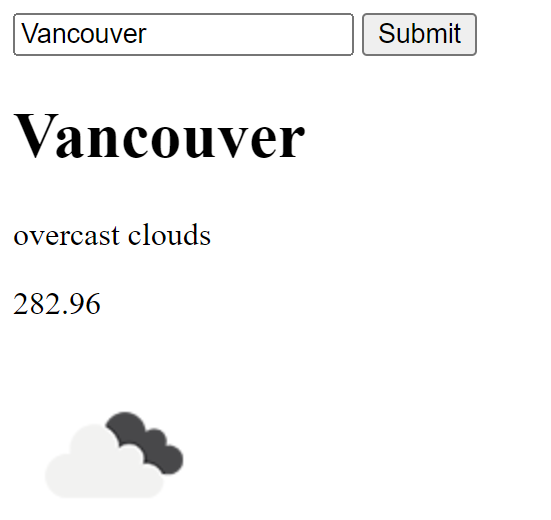

# Weather App

Build a web app that would ask the user to enter a city name and to output the weather temperature, description, and in image showing the current conditions using the `openweathermap.org` API.

## Demo

## Requirements

- Build a frontend webpage that would ask a user to enter a city name and deploy it on Netlify.
- Build a backend server that would take the city name from the frontend and make a request to the `openweathermap.org` API and return the weather temperature, description, and in image showing the current conditions.

# Deployment 
- Deploy the frontend on Netlify
- Deploy the backend on Render